<div align="center">


<h1>Data Residency Blueprints</h1>

<p><strong>The Enterprise Standard for Architecting, Governing, and Validating Global Data Sovereignty and Localization</strong></p>

[]()
[]()
[]()
[]()

<br/>

> **"In a world of digital borders, data residency is the new perimeter."** 
> Data Residency Blueprints is a flagship platform designed to help enterprises design, deploy, and validate compliant architectures for data residency, sovereignty, and cross-border transfers.

</div>

---

## 🏛️ Executive Summary

**Data Residency Blueprints** is a flagship repository designed for Chief Privacy Officers (CPOs), CISOs, and Enterprise Architects. As nations increasingly enforce data localization laws (e.g., EU Data Boundary, India DPDP, China DSL), organizations must move beyond "Policy on Paper" to **Industrialized Sovereignty**.

This platform provides an industrialized approach to **Data Placement**, delivering production-ready **Policy Engines**, **Regional Blueprints**, **Sovereign Cloud Patterns**, and **Compliance Scorecards**. It supports **Azure**, **AWS**, **GCP**, and **SaaS** ecosystems, enabling teams to build globally distributed platforms that are inherently compliant by design.

---

## 💡 Why Data Residency Matters

Sovereignty is the "Legal Border" of the data estate:
- **Regulatory Compliance**: Meeting stringent localization requirements in 130+ jurisdictions.
- **Risk Mitigation**: Reducing exposure to cross-border transfer litigations and fines.
- **Customer Trust**: Assuring users that their sensitive data remains within their national boundaries.
- **Sovereign Continuity**: Ensuring business operations are resilient to international legal shifts.

---

## 🚀 Business Outcomes

### 🎯 Strategic Residency Impact
- **Compliant Global Expansion**: Rapidly entering new markets with pre-validated regional landing zone blueprints.
- **Privacy-by-Design**: Automating the enforcement of data placement rules at the infrastructure layer.
- **Operational Transparency**: Providing real-time evidence of data locality to regulators and auditors.
- **Reduced Legal Overhead**: Standardizing the governance of Standard Contractual Clauses (SCCs) and Data Processing Agreements (DPAs).

---

## 🏗️ Technical Stack

| Layer | Technology | Rationale |
|---|---|---|
| **Policy Engine** | Python, OPA (Open Policy Agent) | Industry-standard policy-as-code for residency validation. |
| **Control Plane** | FastAPI | High-performance API for blueprints, scoring, and exceptions. |
| **Frontend** | React 18, Vite | Premium portal for global region mapping and compliance visibility. |
| **IaC Foundation** | Terraform | Multi-cloud regional infrastructure orchestration and pinning. |
| **Database** | PostgreSQL | Centralized repository for blueprints, policies, and evidence. |
| **Observability** | Prometheus / Grafana | Real-time monitoring of regional compliance and policy drift. |

---

## 📐 Architecture Storytelling: 60+ Diagrams

### 1. Executive High-Level Architecture
The holistic vision of the enterprise data sovereignty lifecycle.

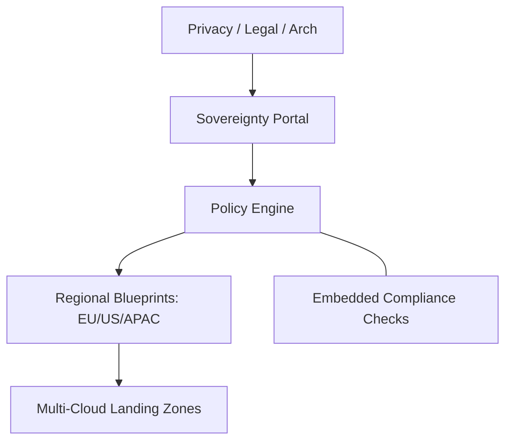

### 2. Detailed Component Topology
The internal service boundaries and management layers of the platform.

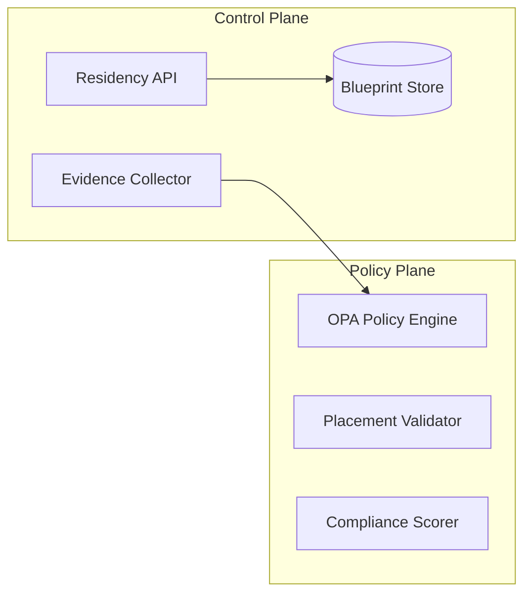

### 3. Frontend to Backend Request Path
Tracing a "Validate EU Blueprint" request through the stack.

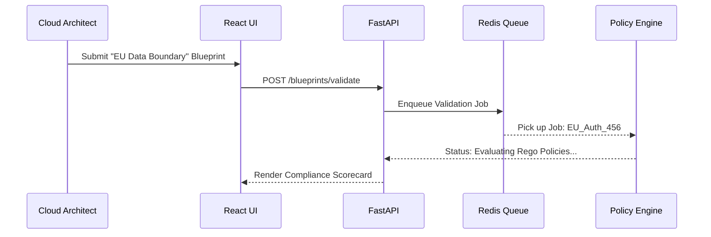

### 4. Multi-Region Control Plane
The "Brain" of the framework managing cross-border sync definitions.

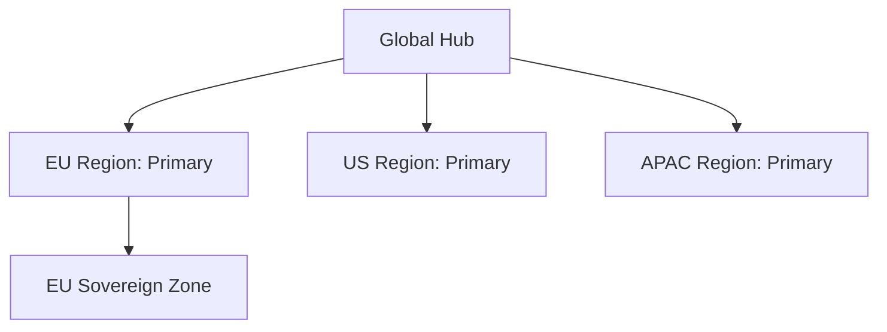

### 5. Multi-Cloud Topology
Synchronizing residency standards across diverse storage and compute layers.

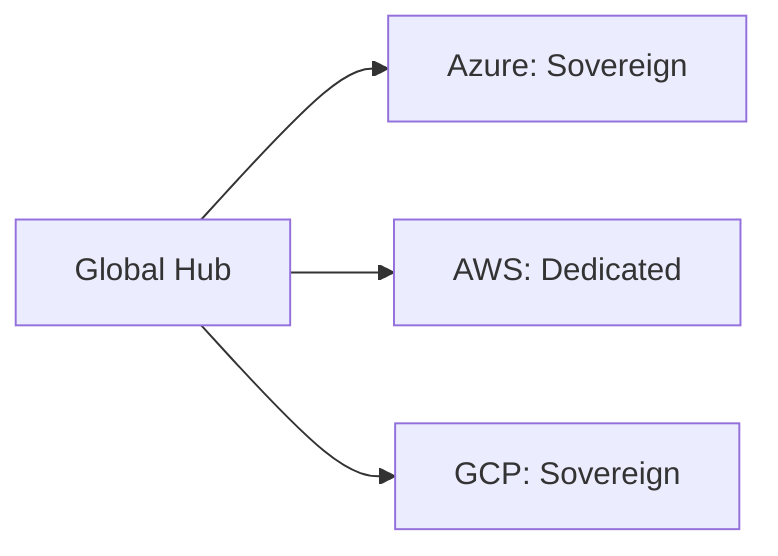

### 6. Regional Deployment Model
Hosting policy engines close to the data for sovereignty assurance.

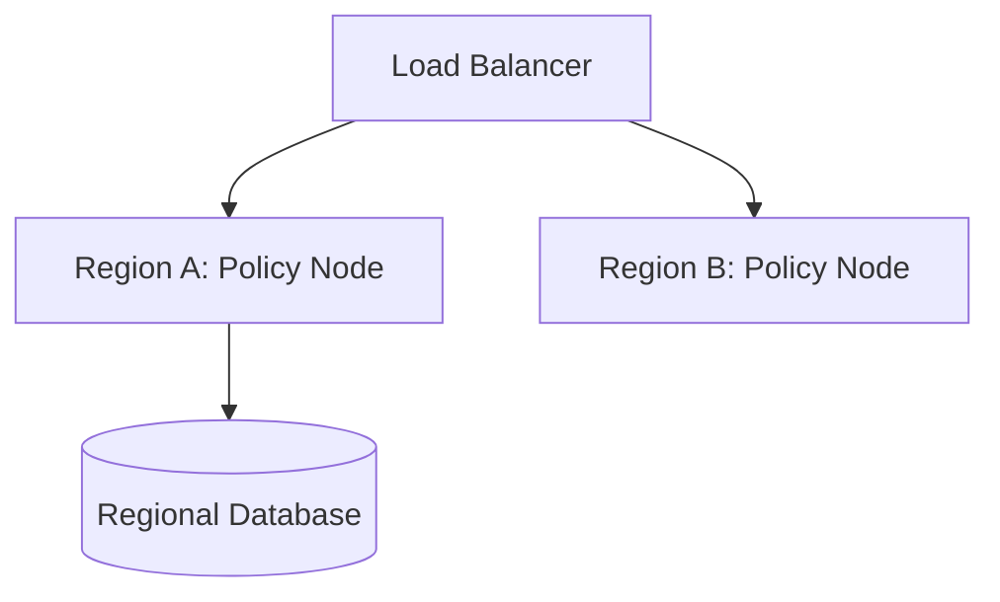

### 7. DR Failover Model
Ensuring residency-compliant failover within legal boundaries.

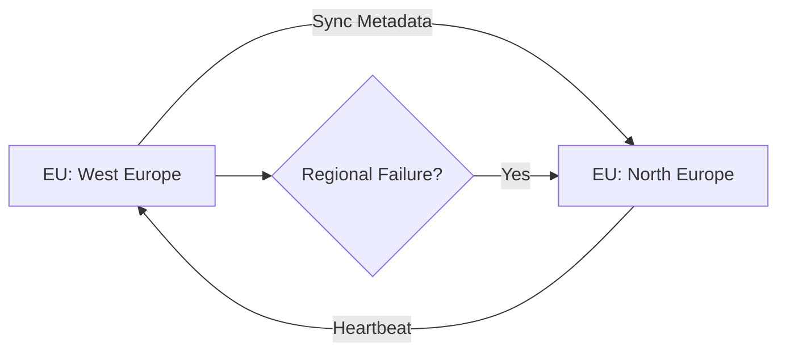

### 8. API Gateway Architecture
Securing and throttling the entry point for residency orchestration.

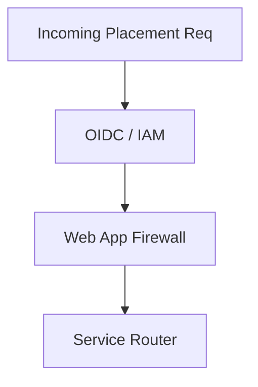

### 9. Queue Worker Architecture
Managing long-running evidence collection and scoring tasks at scale.

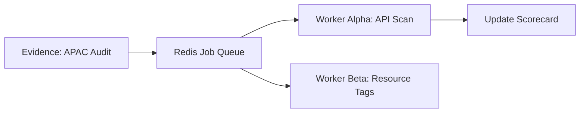

### 10. Dashboard Analytics Flow
How raw placement telemetry becomes executive sovereignty scorecards.

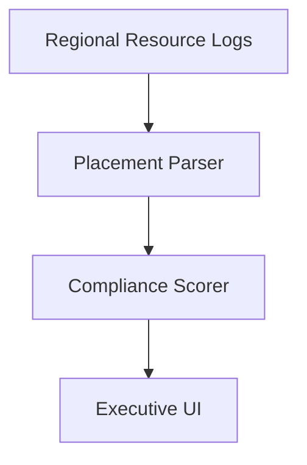

### 11. Country Data Boundary Model
Enforcing regional boundaries for all data traffic.

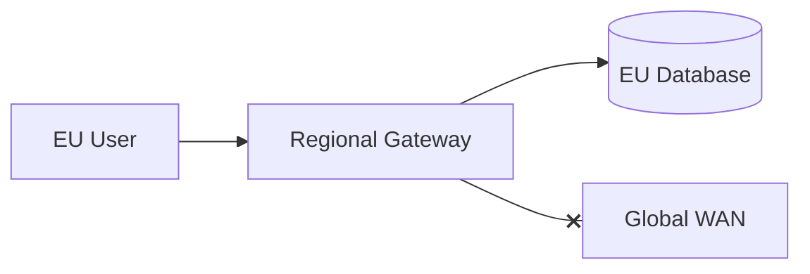

### 12. EU Residency Architecture
Compliant design for the European Data Boundary.

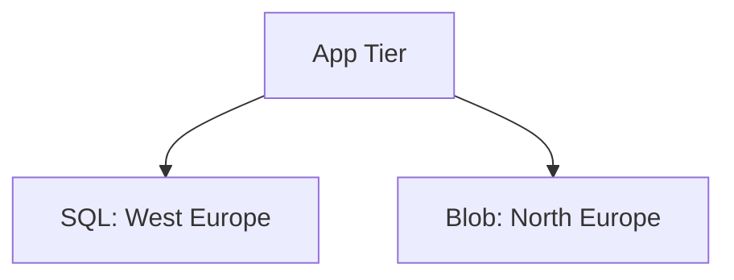

### 13. UK Sovereign Pattern
Post-Brexit data localization for UK regulated industries.

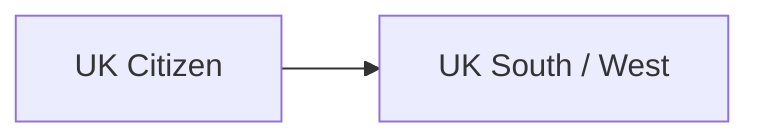

### 14. US Federal Isolated Model
Highly regulated workloads for US public sector.

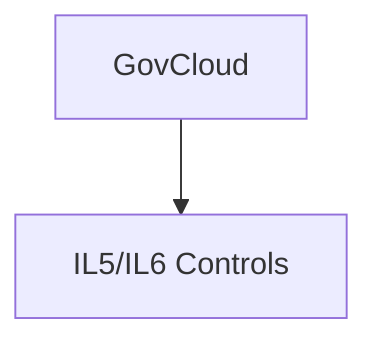

### 15. APAC Regional Partitioning
Managing fragmentation across APAC jurisdictions.

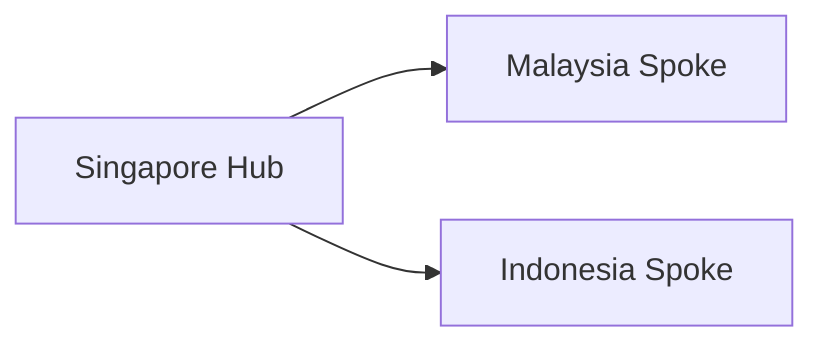

### 16. GCC Sovereign Zone Model
Data localization for the Gulf Cooperation Council.

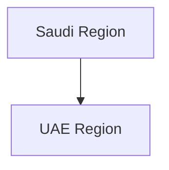

### 17. Citizen Data Localization Flow
How specific user types are routed to national stores.


### 18. Tenant Regional Pinning Model
Isolating B2B tenants within specific geographies.

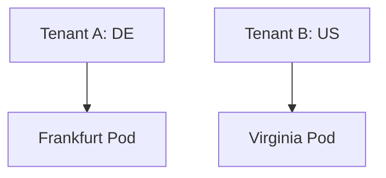

### 19. Residency-aware Sharding Model
Distributing data at the record level based on residency.


### 20. Regional Failover Boundaries
Restricting DR to legally allowed neighboring regions.

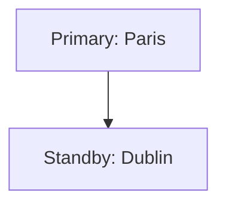

### 21. Cross-border Transfer Approval Flow
The governance of data movement across borders.

```mermaid
graph LR
    Req[Transfer Req] --> Legal[Legal Review]
    Legal --> Exec[DPO Approval]
```

### 22. SCC / DPA Workflow
Automating the association of legal docs with technical pipes.

```mermaid
graph TD
    Pipe[Data Pipe] --> SCC[Standard Contractual Clauses]
```

### 23. Data Minimization Lifecycle
Reducing residency risk by minimizing data collection.

```mermaid
graph LR
    Collect[Collect] --> Scrub[Remove PII]
```

### 24. Pseudonymization Model
Replacing identifiers to enable "safe" processing.

```mermaid
graph TD
    Raw[John Doe] --> Token[User_X_99]
```

### 25. Tokenization by Region Flow
Keeping the "Vault" within the national boundary.

```mermaid
graph LR
    Data[Local Data] --> Vault[Regional Token Vault]
```

### 26. Consent Locality Model
Storing user preferences close to the user.

```mermaid
graph TD
    User[EU User] --> Consent[EU Consent DB]
```

### 27. DSAR Regional Workflow
Handling Subject Access Requests in compliance with local laws.

```mermaid
graph LR
    Req[DSAR] --> Search[Regional Scan]
```

### 28. Deletion Propagation Model
Enforcing "Right to be Forgotten" across regional clusters.

```mermaid
graph TD
    Del[Delete Request] --> Sync[Global Deletion Sync]
```

### 29. Third-party Processor Review
Scoring vendors based on their residency practices.

```mermaid
graph LR
    Vendor[SaaS ABC] --> Risk[Residency Risk: HIGH]
```

### 30. Privacy Incident Escalation
Responding to regional data breaches.

```mermaid
graph TD
    Breach[Breach] --> DPO[DPO Alert]
```

### 31. Regional Database Deployment
Topology for localized persistence.

```mermaid
graph LR
    App[App] --> RDS[Regional Instance]
```

### 32. Geo-partitioned Lakehouse Model
Distributed lakehouse with strictly regional folders.

```mermaid
graph TD
    Lake[Global Lake] --> EU_Dir[/data/eu]
```

### 33. Regional Object Storage Topology
Pinning file assets to specific regions.

```mermaid
graph LR
    S3[Bucket] --> Policy[Deny Cross-Region]
```

### 34. Regional Analytics Workspace Flow
Isolating BI and ML compute within borders.

```mermaid
graph TD
    Data[Local Data] --> Compute[Regional Spark/SQL]
```

### 35. SaaS Connector Locality Model
Ensuring cloud connectors don't exfiltrate data.

```mermaid
graph LR
    Salesforce[CRM] --> Prox[Residency Proxy]
```

### 36. CDN Content Residency Pattern
Managing static assets with sovereignty in mind.

```mermaid
graph TD
    CDN[CDN Edge] --> Policy[Regional Cache Only]
```

### 37. Edge Processing Model
Processing PII at the edge before cloud ingestion.

```mermaid
graph LR
    Edge[Edge Node] --> Scrub[Anonymize]
    Scrub --> Cloud[Global Cloud]
```

### 38. Metadata Segregation Workflow
Ensuring even data headers don't cross borders.

```mermaid
graph TD
    Meta[Metadata] --> Local[Regional Meta Store]
```

### 39. Backup Vault Locality Model
Restricting backup replication to allowed zones.

```mermaid
graph LR
    Vault[Primary Vault] --> Replica[Regional Replica]
```

### 40. Key Management Locality Flow
Keeping encryption keys within national jurisdiction.

```mermaid
graph TD
    KMS[KMS] --> Region[Resident Key Zone]
```

### 41. OIDC / SSO Auth Flow
Secure portal access.

```mermaid
graph LR
    User[User] --> IDP[Regional IDP]
```

### 42. RBAC / ABAC Model
Governing access to residency policies.

```mermaid
graph TD
    Admin[Residency Admin] --> Write[Edit Blueprints]
```

### 43. Secrets Management Flow
Securing regional service credentials.

```mermaid
graph LR
    App[App] --> Vault[Regional KV]
```

### 44. Audit Logging Architecture
Centralized logging of residency violations.

```mermaid
graph TD
    Violation[Drift] --> Audit[(Audit Log)]
```

### 45. Policy-as-code Lifecycle
The workflow for updating residency rules.

```mermaid
graph LR
    Git[Rego Code] --> CI[Test]
    CI --> CD[Deploy to OPA]
```

### 46. Continuous Compliance Checks
Periodic scanning of cloud resources.

```mermaid
graph TD
    Scanner[Scanner] --> Report[Scorecard]
```

### 47. Evidence Collection Workflow
Automating the gathering of residency proofs.

```mermaid
graph LR
    API[Cloud API] --> Evidence[JSON Proof]
```

### 48. Risk Review Model
Evaluating the residency impact of new projects.

```mermaid
graph TD
    Project[New App] --> Score[Impact: MED]
```

### 49. Exception Approval Workflow
Managing legitimate temporary residency variances.

```mermaid
graph LR
    Waiver[Request] --> Board[Privacy Board]
```

### 50. Vendor Governance Cadence
The rhythm of third-party residency audits.

```mermaid
graph TD
    Review[Q1 Audit] --> Action[Remediation Plan]
```

### 51. Metrics Pipeline
Monitoring the performance of the residency stack.

```mermaid
graph LR
    Engine[Engine] --> Prom[Prometheus]
```

### 52. Logging Architecture
Centralized residency engine records.

```mermaid
graph TD
    Pod[Engine Pod] --> Loki[Loki]
```

### 53. Tracing Model
Tracing placement requests across services.

```mermaid
graph LR
    Portal[UI] --> Trace[OTel Trace]
```

### 54. SLA Monitoring Flow
Visualizing compliance uptime against targets.

```mermaid
graph TD
    Score[99.9%] --> Gauge[Compliance SLA]
```

### 55. Release Pipeline Workflow
Continuous delivery of the blueprints.

```mermaid
graph LR
    Git[Code] --> GHA[Deploy]
```

### 56. Executive KPI Review Cycle
Reporting sovereignty scores to the CPO.

```mermaid
graph TD
    Stats[Stats] --> Deck[Executive Deck]
```

### 57. Regional Cost Model
Tracking the cost of localization.

```mermaid
graph LR
    Region[EU] --> Cost[$1.4M / yr]
```

### 58. Compliance Scorecard Flow
How technical checks become business scores.

```mermaid
graph TD
    Checks[Checks] --> Grade[A+]
```

### 59. Maturity Roadmap
The journey to industrialized sovereignty.

```mermaid
graph LR
    P1[Reactive] --> P2[Native]
```

### 60. Operating Committee Cadence
The rhythm of data residency governance.

```mermaid
graph TD
    Meeting[Committee] --> Policy[New Standards]
```

---

## 🔬 Data Residency Methodology

### 1. Residency vs. Sovereignty
- **Data Residency**: Refers to the physical/geographical location where data is stored.
- **Data Sovereignty**: Refers to the data being subject to the laws of the country in which it is located.
- **Data Localization**: The requirement that data remain within a specific country's borders.

### 2. The Three Sovereignty Pillars
- **Infrastructure Sovereignty**: Controlling the physical hardware and data centers.
- **Software Sovereignty**: Controlling the code, logic, and processing.
- **Operational Sovereignty**: Controlling who can access and manage the environment.

---

## 🚦 Getting Started

### 1. Prerequisites
- **Terraform** (v1.5+).
- **Docker Desktop**.
- **Azure/AWS/GCP CLI** configured.

### 2. Local Setup
```bash
# Clone the repository
git clone https://github.com/Devopstrio/data-residency-blueprints.git
cd data-residency-blueprints

# Start the Residency Control Plane
docker-compose up --build
```
Access the Residency Portal at `http://localhost:3000`.

---

## 🛡️ Governance & Security
- **Privacy-by-Design**: Residency controls are embedded into the CI/CD pipeline, ensuring no resource can be provisioned in an unapproved region.
- **Immutable Auditability**: All administrative actions and data placement validations are logged to an immutable store.
- **Encryption Locality**: Hardware security modules (HSMs) are pinned to specific regional data boundaries, ensuring keys never cross borders.

---
<sub>&copy; 2026 Devopstrio &mdash; Engineering the Future of Industrialized Data Sovereignty.</sub>
