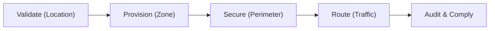
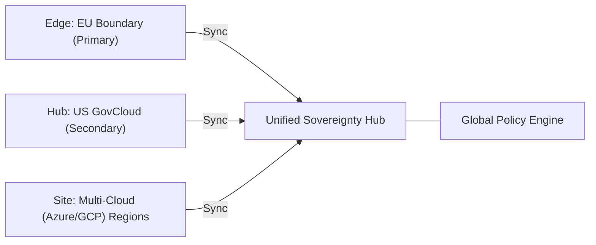
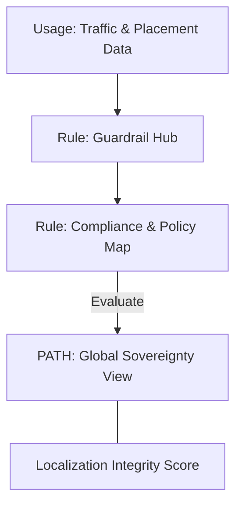
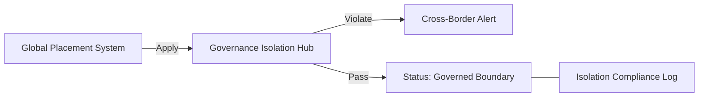
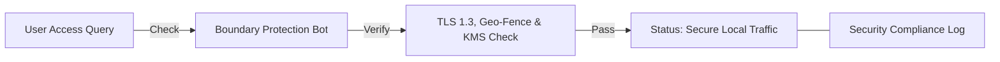
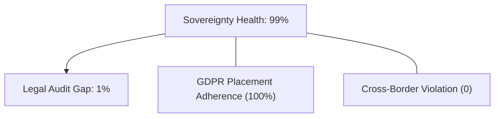
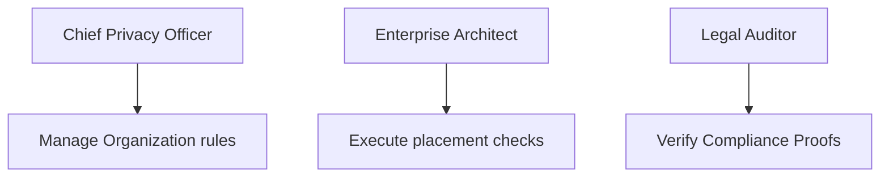
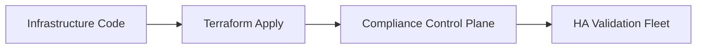
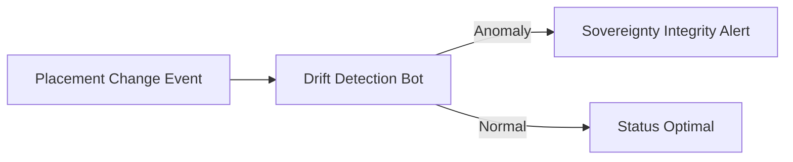
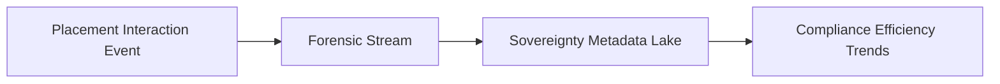

<div align="center">


<h1>Data Residency Blueprints</h1>

<p><strong>The Institutional-Grade Platform for Standardized Data Sovereignty, Regional Governance, and Multi-Cloud Localization Ecosystems.</strong></p>

[]()
[]()
[]()

<br/>

> **"Industrializing data placement to automate sovereign foundations."** 
> **Data Residency Blueprints** is an enterprise-grade solution designed to provide a secure, measurable, and highly automated foundation for global data sovereignty operations. It orchestrates the complex lifecycle of residency compliance—from landing zone provisioning and traffic routing to cross-border transfer prevention and unified regulatory auditing.

</div>

---

## 🏛️ Executive Summary

Fragmented regional policies and manual compliance checks are strategic operational liabilities; lack of centralized residency orchestration is a primary barrier to organizational global expansion and regulatory adherence. Organizations fail to maintain data sovereignty not because of a lack of cloud regions, but because of fragmented localization standards, lack of automated placement validation, and an inability to orchestrate compliance planes with legal precision.

This repository provides the **Sovereignty Intelligence Plane**. It implements a complete **Residency-Blueprint-as-Code Framework**, enabling Enterprise Architecture and Privacy teams to manage global localization foundations as first-class citizens. By automating the identification of compliance bottlenecks through real-time telemetry analysis and orchestrating the provisioning of secure performance-driven placement policies, we ensure that every organizational workload—from EU-bound citizen data to US Federal systems—is localized by default, audited for history, and strictly aligned with institutional regulatory frameworks (GDPR, CCPA).

---

## 📐 Architecture Storytelling: Principal Reference Models

### 1. Principal Architecture: Global Data Residency & Sovereignty Intelligence Plane
This diagram illustrates the end-to-end flow from data ingress and multi-cloud orchestration to placement enforcement, compliance validation, and institutional sovereignty auditing.


```mermaid
graph LR
    %% Subgraph Definitions
    subgraph DataIngress["Global Traffic & User Ingress"]
        direction TB
        Global_Users["EU / US / APAC Citizens"]
        Geo_Routing["DNS / Traffic Managers"]
        Edge_Networks["CDN / Sovereign Gateways"]
    end

    subgraph IntelligenceEngine["Sovereignty Intelligence Hub"]
        direction TB
        API["FastAPI Residency Gateway"]
        PlacementOrchestrator["Global Boundary & Hub"]
        Governance_Hub["Compliance & Legal Guardrail Hub"]
        AIOps_Validator["Drift & Transfer Analysis Hub"]
    end

    subgraph OperationsPlane["Distributed Sovereign Ecosystem"]
        direction TB
        ManagedRegions["Managed Standardized Sovereign Clouds"]
        ActiveBoundaries["Managed Automated Data Perimeters"]
        ComplianceSinks["Managed Regulatory Evidence Hubs"]
    end

    subgraph OperationsHub["Institutional Sovereignty Hub"]
        direction TB
        Scorecard["Compliance Maturity Scorecard"]
        Analytics["Placement Fidelity & Readiness Velocity Stats"]
        Audit["Forensic Sovereignty Metadata Lake"]
    end

    subgraph DevOps["Residency-Blueprint-as-Code Framework"]
        direction TB
        TF["Terraform Sovereign Modules"]
        DriftBot["Placement & Config Drift Validator"]
        ChatOps["Localization Operations Hub"]
    end

    %% Flow Arrows
    DataIngress -->|1. Submit Request| API
    API -->|2. Orchestrate Placement| PlacementOrchestrator
    PlacementOrchestrator -->|3. Apply Legal Guard| Governance_Hub
    Governance_Hub -->|4. Assess Drift| AIOps_Validator
    
    AIOps_Validator -->|5. Execute Enforcement| OperationsPlane
    OperationsPlane -->|6. Notify Status| ChatOps
    API -->|7. Visualize Health| Scorecard
    
    Scorecard -->|8. Track Maturity| Analytics
    Scorecard -->|9. Record Validation| Audit
    
    TF -->|10. Provision Backbone| IntelligenceEngine
    DriftBot -->|11. Inject Compliance Risk| PlacementOrchestrator
    Audit -->|12. Improve Operations| ManagedRegions

    %% Styling
    classDef ingress fill:#f5f5f5,stroke:#616161,stroke-width:2px;
    classDef intel fill:#e8eaf6,stroke:#1a237e,stroke-width:2px;
    classDef operations fill:#e1f5fe,stroke:#01579b,stroke-width:2px;
    classDef ops fill:#ede7f6,stroke:#311b92,stroke-width:2px;
    classDef devops fill:#e8f5e9,stroke:#1b5e20,stroke-width:2px;

    class DataIngress ingress;
    class IntelligenceEngine intel;
    class OperationsPlane operations;
    class OperationsHub ops;
    class DevOps devops;
```

### 2. The Sovereign Placement Lifecycle Flow
The continuous path of a residency platform from initial validation (location) and provisioning (landing zone) to active security (perimeter), routing (traffic), and institutional forensic auditing (compliance).


```mermaid
graph LR
    Validate["Validate (Location)"] --> Provision["Provision (Zone)"]
    Provision --> Secure["Secure (Perimeter)"]
    Secure --> Route["Route (Traffic)"]
    Route --> Audit["Audit & Comply"]
```

### 3. Distributed Sovereign Topology
Strategically orchestrating standardized data boundaries across global regions, national borders, and multi-cloud environments, providing a unified institutional view of global data sovereignty.


```mermaid
graph LR
    RegionEU["Edge: EU Boundary (Primary)"] -->|Sync| Hub["Unified Sovereignty Hub"]
    RegionUS["Hub: US GovCloud (Secondary)"] -->|Sync| Hub
    Cloud["Site: Multi-Cloud (Azure/GCP) Regions"] -->|Sync| Hub
    Hub --- Logic["Global Policy Engine"]
```

### 4. Residency Governance & High-Trust Data Plane Protection Flow
Executing complex logic for securing the bridge between global users, regional gateways, and sovereign databases, ensuring every organizational identity is verified and every data placement is according to institutional standards.


```mermaid
graph TD
    ResidencyData["Usage: Traffic & Placement Data"] --> Bridge["Rule: Guardrail Hub"]
    Bridge --> PolicyMap["Rule: Compliance & Policy Map"]
    PolicyMap -->|Evaluate| Context["PATH: Global Sovereignty View"]
    Context --- Estimate["Localization Integrity Score"]
```

### 5. Multi-Cloud Sovereignty Federation Flow
Automatically managing unified compliance standards across Azure Sovereign Cloud, AWS GovCloud/Dedicated, and GCP Assured Workloads, ensuring institutional residency consistency and legal boundaries by default.


```mermaid
graph LR
    Org["Global Placement System"] -->|Apply| Guard["Governance Isolation Hub"]
    Guard -->|Violate| Alert["Cross-Border Alert"]
    Guard -->|Pass| Verify["Status: Governed Boundary"]
    Verify --- Audit["Isolation Compliance Log"]
```

### 6. Encryption & Perimeter Protection Flow (Sovereign Standard)
Managing the lifecycle of a data ingress request, automatically enforcing institutional TLS 1.3, Regional KMS (Key Management Service), and strict geo-fencing standards as required by sovereignty policy.


```mermaid
graph LR
    DataReq["User Access Query"] -->|Check| Gatekeeper["Boundary Protection Bot"]
    Gatekeeper -->|Verify| TLS["TLS 1.3, Geo-Fence & KMS Check"]
    TLS -->|Pass| Admit["Status: Secure Local Traffic"]
    Admit --- Audit["Security Compliance Log"]
```

### 7. Institutional Compliance Maturity Scorecard
Grading organizational performance based on key indicators: GDPR Adherence, Cross-Border Transfer Prevention, and Sovereign Continuity.


```mermaid
graph TD
    Post["Sovereignty Health: 99%"] --> Risk["Legal Audit Gap: 1%"]
    Post --- C1["GDPR Placement Adherence (100%)"]
    Post --- C2["Cross-Border Violation (0)"]
```

### 8. Identity & RBAC for Sovereign Governance
Managing fine-grained access to policy engines, provisioning zones, and audit logs between Chief Privacy Officers, Enterprise Architects, and Legal Auditors.


```mermaid
graph TD
    CPO["Chief Privacy Officer"] --> Hub["Manage Organization rules"]
    Architect["Enterprise Architect"] --> Exec["Execute placement checks"]
    Auditor["Legal Auditor"] --> Audit["Verify Compliance Proofs"]
```

### 9. IaC Deployment: Residency-Blueprint-as-Code Framework
Using modular Terraform to deploy and manage the versioned distribution of the sovereignty tracking hubs, policy protection workers, and forensic metadata lakes.


```mermaid
graph LR
    HCL["Infrastructure Code"] --> TF["Terraform Apply"]
    TF --> Engine["Compliance Control Plane"]
    Engine --> Clusters["HA Validation Fleet"]
```

### 10. AIOps Sovereignty Drift & Risk Validation Flow
Using advanced analytics to identify sudden surges in unauthorized cross-border traffic, regional configuration drifts, suspicious data transfers, or unusual placement pattern changes that could result in institutional risk or regulatory fines.


```mermaid
graph LR
    Drift["Placement Change Event"] --> Analyzer["Drift Detection Bot"]
    Analyzer -->|Anomaly| Alert["Sovereignty Integrity Alert"]
    Analyzer -->|Normal| Pass["Status Optimal"]
```

### 11. Metadata Lake for Forensic Compliance Audit
Storing long-term records of every compliance policy assessed (metadata), every data placement executed, and every regulatory audit history for institutional record-keeping, compliance auditing, and post-provisioning forensics.


```mermaid
graph LR
    Provision["Placement Interaction Event"] --> Stream["Forensic Stream"]
    Stream --> Lake["Sovereignty Metadata Lake"]
    Lake --> Trends["Compliance Efficiency Trends"]
```

---

## 🏛️ Core Governance Pillars

1.  **Unified Foundation Coordination**: Maximizing compliance by centralizing all localization workflows through a single institutional plane.
2.  **Automated Boundary Provisioning**: Eliminating "manual compliance checks" scenarios through proactive orchestration and pattern verification.
3.  **Sequential Sovereignty Intelligence**: Ensuring zero-interruption operations through dependency-aware policy-driven platform engineering.
4.  **Zero-Trust Placement Protection**: Automatically enforcing identity-based access and geo-fencing evaluation across all infrastructure tiers.
5.  **Autonomous Operations Logic**: Guaranteeing reliability through automated industry-specific regulatory monitoring runbooks.
6.  **Full Sovereignty Auditability**: Immutable recording of every region deployment and boundary validation for institutional forensics.

---

## 🛠️ Technical Stack & Implementation

### Sovereignty Engine & APIs
*   **Framework**: Python 3.11+ / FastAPI.
*   **Performance Engine**: Custom Python-based logic for multi-cloud policy enforcement and GDPR-style readiness metrics.
*   **Integrations**: Native connectors for OPA (Open Policy Agent), Azure Policy, AWS Config, and GCP Security Command Center.
*   **Persistence**: PostgreSQL (Sovereignty Ledger) and Redis (Live Placement State).
*   **Auth Orchestrator**: Federated OIDC/SAML for least-privilege boundary management access.

### Governance Dashboard (UI)
*   **Framework**: React 18 / Vite.
*   **Theme**: Dark, Slate, Indigo (Modern high-fidelity compliance aesthetic).
*   **Visualization**: D3.js for boundary topologies and Recharts for readiness velocity analytics.

### Infrastructure & DevOps
*   **Runtime**: AWS EKS or Azure Kubernetes Service (AKS) for management plane.
*   **Sovereignty Hub**: Managed event sourcing for immutable compliance timeline reconstruction.
*   **IaC**: Modular Terraform for deploying the localization landing zone and validation fleet.

---

## 🏗️ IaC Mapping (Module Structure)

| Module | Purpose | Real Services |
| :--- | :--- | :--- |
| **`infrastructure/sovereignty_hub`** | Central management plane | EKS, PostgreSQL, Redis |
| **`infrastructure/policy_workers`** | Distributed automation workers | Azure, AWS, GCP APIs |
| **`infrastructure/routing_pipes`** | Placement Orchestration Hubs | Webhooks, Global LBs |
| **`infrastructure/auditing`** | Forensic compliance sinks | S3, Athena, Quicksight |

---

## 🚀 Deployment Guide

### Local Principal Environment
```bash
# Clone the Data Residency Blueprints repository
git clone https://github.com/devopstrio/data-residency-blueprints.git
cd data-residency-blueprints

# Configure environment
cp .env.example .env

# Launch the Sovereignty stack
make init

# Trigger a mock localization request and automated guardrail validation simulation
make simulate-residency
```

Access the Management Portal at `http://localhost:3000`.

---

## 📜 License
Distributed under the MIT License. See `LICENSE` for more information.

---
<div align="center">
  <p>© 2026 Devopstrio. All rights reserved.</p>
</div>
